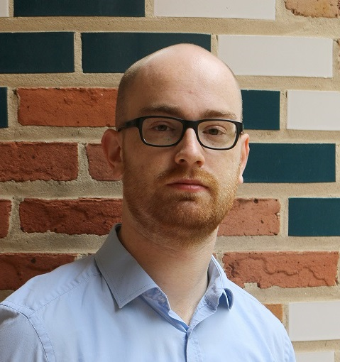

## Welcome!

I am a graduate student in applied mathematics at Rice University.
My main research interests are:

* Numerical methods for partial differential equations
* Iterative linear solvers and preconditioners
* Finite element and discontinuous Galerkin methods
* Scalable implementation of numerical software
* Fluid flow in porous media with applications to hydrocarbon recovery

Furthermore, I am also interested in the application of software engineering techniques in scientific software.

{: height="250px"}
